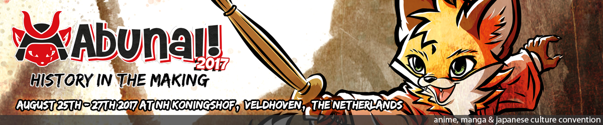
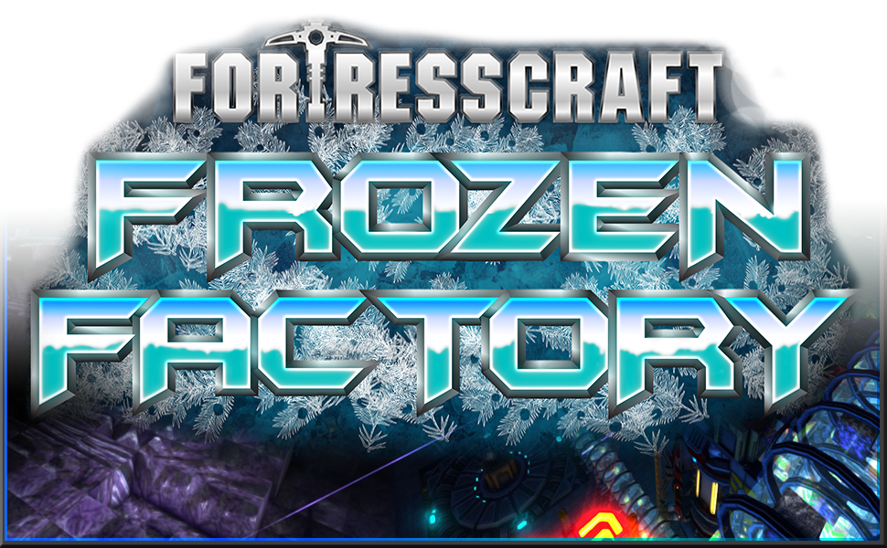

### Our next event
 
## [Abunai! 2017](http://www.abunaicon.nl/)

For the 14th year running we will be the biggest anime convention in The Netherlands, Abunai!.

We will be there with many popular ProjectorGames including FallDown, 1942 and TowerDefense. These 32 player games are played on a big screen, and you can pick up a controller and join in at any time.

If you're in The Netherlands or can get there easily, come along and join in the fun. 

25th - 27th August NH Veldhoven, Netherlands

### Our latest Game

## [FortressCraft](/games/fortresscraft)

The original FortressCraft was one of the best-selling Indie games of all time and in FortressCraft: Evolved we've taken it to he next level. A unique blend of Voxel Landscapes, Tower Defense, Crafting, Logistics, Exploration, Combat and Assembly Lines.

### Upcoming games

[Tactics Forever](/games/tacticsforever)
